# Procédure détaillée – Déploiement Active Directory TechNord SAS

> Compte-rendu pas à pas de la réalisation du TP, organisé selon les 10 parties du plan initial. Les emplacements `[CAPTURE: ...]` indiquent où insérer mes captures d'écran (dossier `captures/`).

## Sommaire

1. [Mise en place de l'infrastructure VirtualBox](#1--mise-en-place-de-linfrastructure-virtualbox)
2. [Installation et configuration de Windows Server](#2--installation-et-configuration-de-windows-server)
3. [Déploiement du rôle Active Directory (AD DS)](#3--déploiement-du-rôle-active-directory-ad-ds)
4. [Structuration de l'annuaire (OU, groupes)](#4--structuration-de-lannuaire-ou-groupes)
5. [Création et gestion des comptes utilisateurs](#5--création-et-gestion-des-comptes-utilisateurs)
6. [Jonction de la station Windows 10 au domaine](#6--jonction-de-la-station-windows-10-au-domaine)
7. [Stratégies de groupe (GPO)](#7--stratégies-de-groupe-gpo)
8. [Profils itinérants et dossiers personnels](#8--profils-itinérants-et-dossiers-personnels)
9. [Délégation d'administration](#9--délégation-dadministration)
10. [Vérification et validation finale](#10--vérification-et-validation-finale)
11. [Dépannage – difficultés rencontrées](#dépannage--difficultés-rencontrées)
12. [Réponses aux questions de réflexion](#réponses-aux-questions-de-réflexion)
13. [Bilan et compétences acquises](#bilan-et-compétences-acquises)

---

## 1 – Mise en place de l'infrastructure VirtualBox

### 1.1 Plan d'adressage réseau

J'ai défini le plan d'adressage suivant pour le réseau interne `LAN-TECHNORD` :

| Machine | Rôle | Adresse IP | Masque | Passerelle | DNS |
| --- | --- | --- | --- | --- | --- |
| SRV-AD01 | Contrôleur de domaine | 192.168.10.1 | 255.255.255.0 | 192.168.10.254 | 127.0.0.1 |
| PC-COMMERCIAL01 | Station Windows 10 | 192.168.10.10 | 255.255.255.0 | 192.168.10.254 | 192.168.10.1 |

### 1.2 Création des machines virtuelles

**SRV-AD01 (Windows Server 2022)**

- Nom : `SRV-AD01` | Type : Microsoft Windows | Version : Windows 2022 (64 bits)
- RAM : 4096 Mo, 2 vCPU
- Disque : VDI de 60 Go, alloué dynamiquement
- Réseau : Adaptateur 1 en mode **Réseau interne**, nom `LAN-TECHNORD`

**PC-COMMERCIAL01 (Windows 10)**

- Nom : `PC-COMMERCIAL01` | Type : Microsoft Windows | Version : Windows 10 (64 bits)
- RAM : 2048 Mo, disque VDI de 40 Go
- Réseau : Adaptateur 1 en mode **Réseau interne**, nom `LAN-TECHNORD`

> Le mode « Réseau interne » isole les VM du réseau de l'hôte et d'Internet : pour télécharger des fichiers pendant le TP, j'ai temporairement basculé l'adaptateur en « Accès par pont » avant de revenir sur `LAN-TECHNORD`.

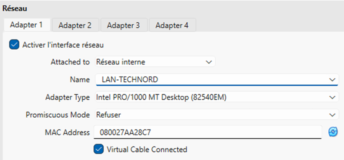

**Seulement les adresses MAC changent**

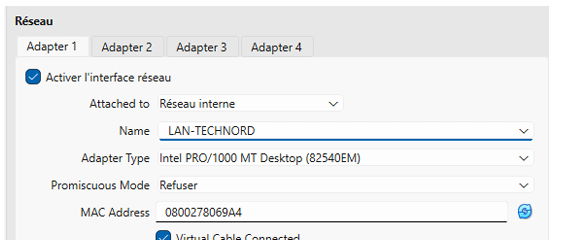

**Validation** : les deux VM apparaissent dans VirtualBox, statut « Éteinte », toutes deux connectées au réseau interne `LAN-TECHNORD`.

---

## 2 – Installation et configuration de Windows Server

### 2.1 Installation de Windows Server 2022 Evaluation

- Démarrage de SRV-AD01 sur l'ISO `SERVER_EVAL_x64FRE_fr-fr`
  
  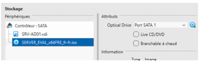
  
- Édition choisie : **Windows Server 2022 Standard Evaluation (Desktop Experience)**, pour disposer de l'interface graphique
  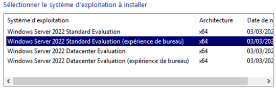
    
- Installation personnalisée sur une partition unique
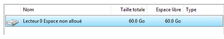
  
- Mot de passe administrateur défini : `Technord@2024!`

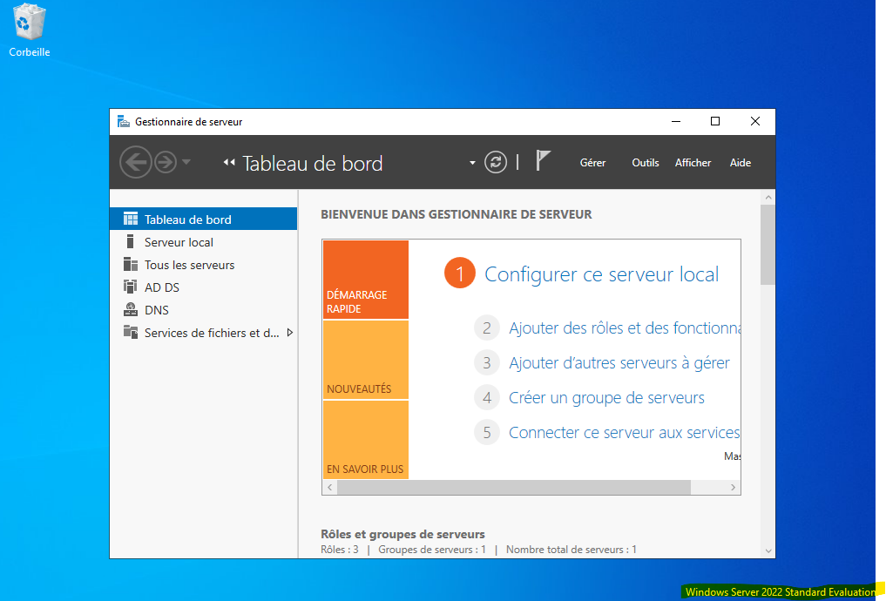

### 2.2 Configuration post-installation

**Renommage du serveur**

Gestionnaire de serveur > Serveur local > nom de l'ordinateur > Modifier > `SRV-AD01`, puis redémarrage.
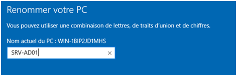

**Adresse IP statique**

Dans les propriétés IPv4 de la carte réseau :
- Adresse IP : `192.168.10.1`
- Masque : `255.255.255.0`
- Passerelle : `192.168.10.254`
- DNS préféré : `127.0.0.1` (le serveur sera son propre DNS)

**Désactivation du pare-feu** (environnement de lab uniquement)
> [!NOTE]
> Pare-feu Windows Defender désactivé pour les profils privé et public, afin de simplifier les tests dans cet environnement isolé. En production, on configurerait des règles précises plutôt que de désactiver le pare-feu.

> [!TIP]
> ``Panneau de configuration > Systeme et securite > Pare-feu Windows Defender``

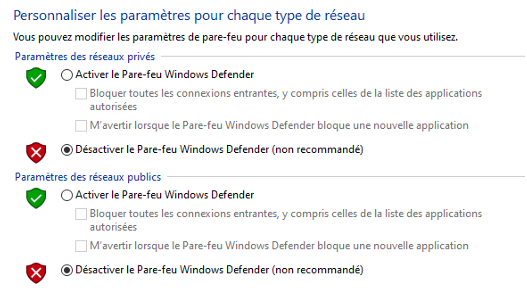

**Validation**

- `ping 192.168.10.1` depuis le serveur réussit *(il faut que les deux VM soient allumées en même temps)*
- Le nom du serveur est bien `SRV-AD01`
- L'adresse IP statique est correctement appliquée

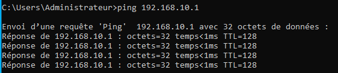

---

## 3 – Déploiement du rôle Active Directory (AD DS)

### 3.1 Installation du rôle AD DS

Gestionnaire de serveur > Ajouter des rôles et fonctionnalités > Installation basée sur un rôle > sélection du serveur SRV-AD01 > rôle **Services AD DS**, avec les fonctionnalités requises ajoutées automatiquement.

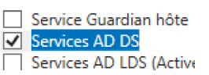

### 3.2 Promotion en contrôleur de domaine

- Promotion via le drapeau d'avertissement du Gestionnaire de serveur
- Choix : **Ajouter une nouvelle forêt**
- Nom de domaine racine : `technord.local`
- Niveau fonctionnel forêt/domaine : Windows Server 2016
- Mot de passe DSRM défini : `Technord@2024!`
- DNS installé automatiquement

> Le mot de passe DSRM (Directory Services Restore Mode) sert aux opérations de maintenance AD en mode restauration. En entreprise, il est conservé dans un coffre-fort de mots de passe dédié.

[CAPTURE: Assistant de promotion, écran de résumé avant installation]

### 3.3 Vérification post-promotion

- Le domaine `technord.local` apparaît dans **Utilisateurs et ordinateurs Active Directory**, avec les conteneurs par défaut : Builtin, Computers, Domain Controllers, Users
- Dans le Gestionnaire DNS, la zone `technord.local` est créée, avec un enregistrement **Hôte (A)** liant `SRV-AD01` à `192.168.10.1`

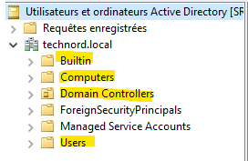
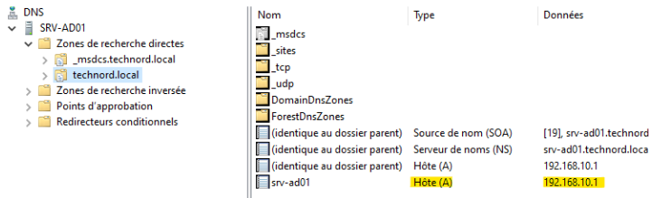

**Validation** : domaine visible, SRV-AD01 listé dans Domain Controllers, zone DNS créée.

---

## 4 – Structuration de l'annuaire

### 4.1 Architecture des unités d'organisation (OU)

```
technord.local
└── TechNord
    ├── Direction
    ├── Commercial
    ├── Technique
    ├── Postes
    ├── Groupes
    └── Administration
```

### 4.2 Création des OU

- Création de l'OU racine `TechNord` avec protection contre la suppression accidentelle activée
- Création des sous-OU `Direction`, `Commercial`, `Technique`, `Postes`, `Groupes`, `Administration`

[CAPTURE: Arborescence des OU dans AD Users and Computers]

### 4.3 Création des groupes de sécurité

Tous les groupes ont été créés dans l'OU `Groupes`, type **Sécurité**, étendue **Globale** :

| Nom du groupe | Description |
| --- | --- |
| GG-Direction | Membres du service Direction |
| GG-Commercial | Membres du service Commercial |
| GG-Technique | Membres du service Technique |
| GG-AllUsers | Tous les utilisateurs de l'entreprise |
| GG-Admins-IT | Administrateurs informatiques délégués |

[CAPTURE: Liste des 5 groupes de sécurité dans l'OU Groupes]

**Validation** : arborescence conforme au schéma, 5 groupes créés.

---

## 5 – Création et gestion des comptes utilisateurs

### 5.1 Convention de nommage

- Login : initiale du prénom + nom de famille en minuscules (ex. `Marie Dupont` → `mdupont`)
- Email : `login@technord.local`
- Mot de passe initial : `Technord@2024!` (changement obligatoire à la première connexion)

### 5.2 Comptes créés

| Nom complet | Login | OU | Groupes |
| --- | --- | --- | --- |
| Marie Dupont | mdupont | Direction | GG-Direction, GG-AllUsers |
| Jean-Pierre Martin | jpmartin | Direction | GG-Direction, GG-AllUsers |
| Sophie Bernard | sbernard | Commercial | GG-Commercial, GG-AllUsers |
| Lucas Moreau | lmoreau | Commercial | GG-Commercial, GG-AllUsers |
| Camille Petit | cpetit | Commercial | GG-Commercial, GG-AllUsers |
| Thomas Girard | tgirard | Technique | GG-Technique, GG-AllUsers |
| Alice Lambert | alambert | Technique | GG-Technique, GG-AllUsers |
| Nicolas Leroy | nleroy | Technique | GG-Technique, GG-AllUsers |
| Admin-IT | admin-it | Administration | GG-Admins-IT |

### 5.3 Procédure de création

Pour chaque utilisateur : clic droit sur l'OU cible > Nouveau > Utilisateur, saisie des informations et du mot de passe initial, case « L'utilisateur doit changer de mot de passe à la prochaine ouverture de session » cochée, puis ajout aux groupes via l'onglet **Membre de**.

[CAPTURE: Fiche utilisateur de Sophie Bernard, onglet Général et onglet Membre de]

### 5.4 Création en masse avec PowerShell

Les derniers comptes ont été créés via ce script :

```powershell
Import-Module ActiveDirectory

$users = @(
    @{Prenom='Thomas'; Nom='Girard'; Login='tgirard'; OU='OU=Technique,OU=TechNord,DC=technord,DC=local'},
    @{Prenom='Alice';  Nom='Lambert'; Login='alambert'; OU='OU=Technique,OU=TechNord,DC=technord,DC=local'},
    @{Prenom='Nicolas'; Nom='Leroy';  Login='nleroy'; OU='OU=Technique,OU=TechNord,DC=technord,DC=local'}
)

foreach ($u in $users) {
    New-ADUser -GivenName $u.Prenom -Surname $u.Nom -SamAccountName $u.Login `
        -UserPrincipalName "$($u.Login)@technord.local" `
        -Path $u.OU `
        -AccountPassword (ConvertTo-SecureString 'Technord@2024!' -AsPlainText -Force) `
        -ChangePasswordAtLogon $true -Enabled $true
    Write-Host "Créé : $($u.Login)"
}
```

> **Remarque sécurité** : le mot de passe est ici saisi en clair dans le script (`-AsPlainText`), ce qui est acceptable pour un script ponctuel en environnement de lab isolé. En production, on privilégierait `Get-Credential`, une invite sécurisée, ou la récupération du mot de passe depuis un coffre-fort (ex. gestionnaire de secrets).

[CAPTURE: Exécution du script PowerShell dans une console AD]

**Validation** : les 9 comptes sont créés dans les bonnes OU, chacun membre des groupes attendus, et `admin-it` est bien membre de `GG-Admins-IT`.

---

## 6 – Jonction de la station Windows 10 au domaine

### 6.1 Installation de Windows 10

- Installation de Windows 10 22H2 sur PC-COMMERCIAL01 avec un compte local temporaire
- Configuration IP statique :
  - Adresse IP : `192.168.10.10`
  - Masque : `255.255.255.0`
  - Passerelle : `192.168.10.254`
  - DNS : `192.168.10.1` (pointage obligatoire vers le contrôleur de domaine)

[CAPTURE: Configuration IPv4 de PC-COMMERCIAL01]

### 6.2 Test de connectivité

```
ping 192.168.10.1
ping SRV-AD01.technord.local
```

Les deux commandes réussissent, ce qui valide à la fois la connectivité réseau et la résolution DNS du nom complet du serveur.

[CAPTURE: Résultat des deux ping depuis PC-COMMERCIAL01]

### 6.3 Jonction au domaine

- Renommage du poste en `PC-COMMERCIAL01`
- « Membre d'un domaine » : `technord.local`
- Authentification avec `technord\Administrator` et le mot de passe du DC
- Message de bienvenue dans le domaine, puis redémarrage

[CAPTURE: Message de bienvenue dans le domaine technord.local]

### 6.4 Vérification côté serveur

Sur SRV-AD01, le compte `PC-COMMERCIAL01` apparaît dans le conteneur **Computers** ; il a été déplacé dans l'OU `TechNord / Postes`.

[CAPTURE: Compte ordinateur PC-COMMERCIAL01 dans l'OU Postes]

### 6.5 Connexion avec un compte du domaine

- Connexion avec `technord\sbernard`, mot de passe `Technord@2024!`
- Changement de mot de passe imposé à la première connexion
- Accès au bureau confirmé

[CAPTURE: Écran de connexion / bureau ouvert avec le compte sbernard]

**Validation** : PC-COMMERCIAL01 dans l'OU Postes, connexion de sbernard fonctionnelle, changement de mot de passe demandé.

---

## 7 – Stratégies de groupe (GPO)

### 7.1 Console de gestion des GPO

Ouverte depuis SRV-AD01 via Gestionnaire de serveur > Outils > Gestion de stratégie de groupe.

### 7.2 GPO 1 – Fond d'écran imposé (toute l'OU TechNord)

- Création d'un dossier partagé `C:\Partages\Logon`, partagé sous le nom `Logon`, contenant `fond-technord.jpg`
- GPO `GPO-FondEcran` créée sur l'OU `TechNord`
- Configuration utilisateur > Modèles d'administration > Bureau > Bureau actif > **Papier peint du Bureau** activé, chemin `\\SRV-AD01\Logon\fond-technord.jpg`, style **Étirer**
- Test sur PC-COMMERCIAL01 : `gpupdate /force`, puis reconnexion avec `sbernard`

[CAPTURE: Bureau de sbernard avec le fond d'écran imposé]

### 7.3 GPO 2 – Restriction du Panneau de configuration (OU Commercial)

- GPO `GPO-Restrictions-Commercial` créée sur l'OU `Commercial`
- Configuration utilisateur > Modèles d'administration > Panneau de configuration > **Interdire l'accès au Panneau de configuration et aux paramètres du PC** activé
- Test après `gpupdate /force` : le Panneau de configuration est inaccessible pour `sbernard`

[CAPTURE: Message d'accès refusé au Panneau de configuration pour sbernard]

### 7.4 GPO 3 – Mappage d'un lecteur réseau (OU TechNord)

- Partage `C:\Partages\Commun` créé sous le nom `Commun`, droits `GG-AllUsers` en lecture/écriture
- GPO `GPO-Lecteur-Reseau` créée sur l'OU `TechNord`
- Configuration utilisateur > Préférences > Mappages de lecteurs > Nouveau lecteur connecté, action **Créer**, emplacement `\\SRV-AD01\Commun`, lettre `G:`, option **Reconnecter** cochée (pour que le lecteur reste configuré même si le serveur est temporairement inaccessible au démarrage)

[CAPTURE: Lecteur G: visible dans l'explorateur de fichiers de sbernard]

### 7.5 Diagnostic des GPO appliquées

```
gpresult /r
gpresult /h C:\rapport-gpo.html /f
```

[CAPTURE: Sortie de gpresult /r listant les 3 GPO appliquées]

**Validation** : fond d'écran imposé, Panneau de configuration bloqué pour le service Commercial, lecteur G: mappé automatiquement, et `gpresult /r` liste les 3 GPO.

---

## 8 – Profils itinérants et dossiers personnels

### 8.1 Création des partages serveur

- `C:\Partages\Profiles` partagé sous `Profiles$`, `C:\Partages\HomeDirs` partagé sous `Homes$` (le `$` masque le partage dans l'explorateur)
- Droits de partage : Tout le monde / Contrôle total
- Droits NTFS (héritage désactivé) : `CREATOR OWNER` / Contrôle total + `Administrateurs` / Contrôle total

### 8.2 Profil itinérant pour sbernard

Propriétés du compte `sbernard` > onglet Profil > chemin du profil : `\\SRV-AD01\Profiles$\%username%`

> La variable `%username%` est automatiquement remplacée par le login. Le dossier est créé lors de la première connexion. En entreprise, ce paramétrage se fait via GPO plutôt que compte par compte.

### 8.3 Répertoire personnel pour sbernard

Onglet Profil > Répertoire de base > Connecter `Z:` vers `\\SRV-AD01\Homes$\%username%`

[CAPTURE: Onglet Profil de sbernard avec les deux chemins configurés]

### 8.4 Test

- Connexion avec `sbernard` sur PC-COMMERCIAL01, lecteur `Z:` présent
- Création d'un fichier `test.txt` dans `Z:`
- Déconnexion / reconnexion : le fichier est toujours présent
- Sur SRV-AD01, les dossiers `sbernard` ont bien été créés dans `Profiles$` et `HomeDirs`

[CAPTURE: Lecteur Z: avec le fichier test.txt, et arborescence côté serveur dans Profiles$/HomeDirs]

**Validation** : lecteur Z: fonctionnel et persistant, dossiers créés côté serveur pour le profil et le répertoire personnel.

---

## 9 – Délégation d'administration

### 9.1 Contexte

La direction IT souhaite confier la gestion des comptes utilisateurs du service Commercial à l'administrateur délégué `admin-it`, sans lui accorder les droits d'Administrateur du domaine — application du principe de **moindre privilège**.

### 9.2 Délégation via l'assistant

- Dans **Utilisateurs et ordinateurs AD**, clic droit sur l'OU `Commercial` > **Délégation de contrôle**
- Utilisateur ajouté : `admin-it`
- Tâches déléguées sélectionnées :
  - Créer, supprimer et gérer les comptes d'utilisateurs
  - Réinitialiser les mots de passe et forcer la modification du mot de passe à la prochaine ouverture de session

[CAPTURE: Assistant de délégation de contrôle, écran de récapitulatif sur l'OU Commercial]

> Pour auditer les délégations existantes sur une OU, la commande `dsacls "OU=Commercial,OU=TechNord,DC=technord,DC=local"` permet de lister les permissions effectives.

### 9.3 Test de la délégation

*Non réalisé dans cette itération du projet.* La délégation a été configurée côté annuaire (point 9.2), mais le test pratique (connexion avec `admin-it` depuis PC-COMMERCIAL01 et vérification des droits sur les différentes OU) reste à effectuer.

**Validation partielle** : la délégation est configurée sur l'OU Commercial avec les permissions attendues ; le test fonctionnel côté poste client est à réaliser ultérieurement.

---

## 10 – Vérification et validation finale

### 10.1 Checklist de validation globale

| # | Vérification | Résultat |
| --- | --- | --- |
| 1 | Le domaine technord.local est opérationnel | ✅ |
| 2 | Toutes les OU sont créées selon le schéma prévu | ✅ |
| 3 | Les 5 groupes de sécurité existent dans l'OU Groupes | ✅ |
| 4 | Les 9 comptes utilisateurs sont dans les bonnes OU | ✅ |
| 5 | Chaque utilisateur est membre des bons groupes | ✅ |
| 6 | PC-COMMERCIAL01 est joint au domaine et dans l'OU Postes | ✅ |
| 7 | Connexion domaine fonctionnelle depuis PC-COMMERCIAL01 | ✅ |
| 8 | GPO fond d'écran appliquée à toute l'OU TechNord | ✅ |
| 9 | GPO restrictions appliquée à l'OU Commercial uniquement | ✅ |
| 10 | Lecteur G: mappé automatiquement | ✅ |
| 11 | Lecteur Z: (dossier personnel) fonctionnel pour sbernard | ✅ |
| 12 | Profil itinérant configuré pour sbernard | ✅ |
| 13 | Délégation d'admin-it sur l'OU Commercial effective | ⚠️ configurée, test fonctionnel non réalisé |

[CAPTURE: Vue d'ensemble finale de la console AD Users and Computers]

### 10.2 Commandes de diagnostic utilisées

| Commande | Rôle | Où l'exécuter |
| --- | --- | --- |
| `gpresult /r` | Liste les GPO appliquées à l'utilisateur courant | Station cliente |
| `gpupdate /force` | Force la mise à jour des GPO | Station ou serveur |
| `nltest /dsgetdc:technord.local` | Localise le contrôleur de domaine | Station cliente |
| `net user mdupont /domain` | Affiche les infos du compte domaine | N'importe où |
| `net localgroup` | Liste les groupes locaux de la machine | Station locale |
| `dcdiag` | Diagnostic de santé du contrôleur de domaine | Sur le DC |
| `repadmin /showrepl` | État de la réplication AD (si multi-DC) | Sur le DC |
| `dsacls "OU=..."` | Affiche les délégations sur une OU | Sur le DC (PowerShell) |

---

## Dépannage – difficultés rencontrées

### 1. La jonction au domaine échoue dans un premier temps

**Symptôme** : lors de la jonction de PC-COMMERCIAL01 au domaine `technord.local`, le message d'erreur indiquait qu'aucun contrôleur de domaine n'était joignable, alors que les deux VM étaient bien sur le même réseau interne.

**Diagnostic** : `ping 192.168.10.1` fonctionnait, mais `ping SRV-AD01.technord.local` échouait — le problème venait donc de la résolution de noms, pas de la connectivité réseau.

**Cause** : le DNS de PC-COMMERCIAL01 était encore configuré sur la passerelle (`192.168.10.254`), héritée des paramètres par défaut de l'installation, au lieu de pointer vers `192.168.10.1`.

**Résolution** : reconfiguration de l'adresse DNS préférée de la carte réseau de PC-COMMERCIAL01 vers `192.168.10.1`. Après cette correction, `ping SRV-AD01.technord.local` a réussi et la jonction au domaine s'est déroulée normalement.

**Point de vigilance retenu** : sur un poste client, le DNS doit *toujours* pointer vers le contrôleur de domaine (et jamais vers une passerelle ou un DNS public) pour que la résolution des enregistrements SRV nécessaires à AD fonctionne.

### 2. La GPO de fond d'écran ne s'applique pas immédiatement

**Symptôme** : après création de la GPO `GPO-FondEcran` et un `gpupdate /force`, le fond d'écran de `sbernard` n'avait pas changé.

**Diagnostic** : `gpresult /r` confirmait que la GPO était bien listée comme appliquée, ce qui orientait le problème vers le paramètre lui-même plutôt que vers l'application de la GPO.

**Cause** : le chemin UNC saisi dans la GPO (`\\SRV-AD01\Logon\fond technord.jpg`) contenait un espace dans le nom de fichier, ce qui posait problème pour la résolution du chemin par certains composants Windows.

**Résolution** : renommage du fichier en `fond-technord.jpg` (sans espace) côté serveur, mise à jour du chemin dans la GPO, puis nouveau `gpupdate /force` et reconnexion de `sbernard`. Le fond d'écran s'est appliqué correctement.

**Point de vigilance retenu** : éviter les espaces et caractères spéciaux dans les noms de fichiers/dossiers partagés référencés par des GPO ou des scripts.

### 3. Le lecteur Z: (répertoire personnel) reste inaccessible pour sbernard

**Symptôme** : après configuration du répertoire de base dans les propriétés du compte `sbernard`, le lecteur `Z:` apparaissait bien à la connexion, mais un message « Accès refusé » s'affichait à l'ouverture.

**Diagnostic** : vérification des droits NTFS sur `C:\Partages\HomeDirs` — seuls `CREATOR OWNER` et `Administrateurs` avaient des droits, ce qui est correct en théorie, mais l'héritage avait été désactivé *avant* la création du sous-dossier `sbernard`, qui avait donc hérité de permissions incomplètes.

**Cause** : le dossier `sbernard` créé automatiquement lors de la première connexion n'avait pas correctement reçu les droits `CREATOR OWNER` du fait de l'ordre des opérations (désactivation de l'héritage après la première tentative de connexion).

**Résolution** : suppression du dossier `sbernard` orphelin dans `HomeDirs`, vérification que les droits NTFS `CREATOR OWNER / Contrôle total` et `Administrateurs / Contrôle total` étaient bien appliqués sur `C:\Partages\HomeDirs` avec propagation aux sous-dossiers, puis nouvelle connexion de `sbernard` : le dossier a été recréé avec les bons droits et le lecteur `Z:` est devenu accessible en écriture.

**Point de vigilance retenu** : toujours configurer les droits NTFS *avant* la première connexion des utilisateurs concernés, et vérifier la propagation aux sous-dossiers/fichiers existants en cas de modification ultérieure.

---

