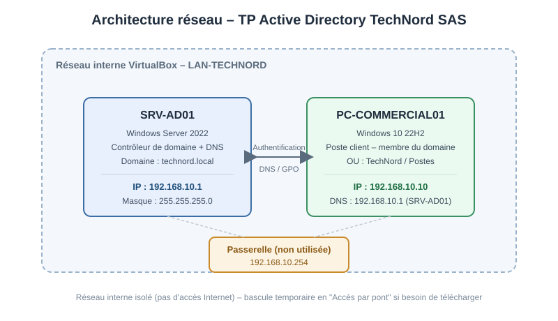

# TP Active Directory – TechNord SAS

Mise en place d'un domaine Active Directory complet (Windows Server 2022 / Windows 10) dans un environnement de lab isolé sous VirtualBox.

## Contexte

Cet exercice simule le déploiement d'un annuaire Active Directory pour **TechNord SAS**, une PME fictive de 40 personnes répartie en 3 services (Direction, Commercial, Technique). En tant qu'« administrateur réseau », j'ai pris en charge l'ensemble du projet, de l'infrastructure virtuelle jusqu'à la délégation d'administration, en passant par la structuration de l'annuaire, le déploiement de stratégies de groupe et la mise en place de profils itinérants.

L'objectif est de reproduire, dans un environnement isolé et sans risque, les tâches qu'un technicien systèmes et réseaux est amené à réaliser en entreprise : déploiement d'un contrôleur de domaine, gestion des identités, sécurisation des accès et administration au quotidien.

## Objectifs pédagogiques

- Déployer un contrôleur de domaine Active Directory (AD DS) et son service DNS
- Structurer un annuaire avec des unités d'organisation (OU) et des groupes de sécurité selon le modèle AGDLP
- Créer et administrer des comptes utilisateurs (manuellement et via PowerShell)
- Joindre un poste client Windows 10 au domaine
- Déployer des stratégies de groupe (GPO) : fond d'écran, restrictions, lecteur réseau
- Configurer des profils itinérants et des répertoires personnels (lecteurs réseau)
- Déléguer une partie de l'administration sans donner les droits d'administrateur du domaine

## Environnement technique

| Machine | Rôle | OS | Adresse IP |
| --- | --- | --- | --- |
| SRV-AD01 | Contrôleur de domaine + DNS | Windows Server 2022 Standard (Eval, Desktop Experience) | 192.168.10.1 |
| PC-COMMERCIAL01 | Poste client | Windows 10 22H2 | 192.168.10.10 |

- **Virtualisation** : VirtualBox, réseau interne dédié `LAN-TECHNORD`
- **Domaine** : `technord.local`
- **Niveau fonctionnel** : Windows Server 2022

## Architecture réseau



## Structure de l'annuaire

```
technord.local
└── TechNord
    ├── Direction
    ├── Commercial
    ├── Technique
    ├── Postes
    ├── Groupes
    │   ├── GG-Direction
    │   ├── GG-Commercial
    │   ├── GG-Technique
    │   ├── GG-AllUsers
    │   └── GG-Admins-IT
    └── Administration
```

## Compétences mobilisées (référentiel BTS SIO SISR)

| Compétence du référentiel | Mise en œuvre dans ce TP |
| --- | --- |
| Administrer les systèmes et l'infrastructure | Installation et configuration de Windows Server 2022, promotion en contrôleur de domaine, configuration DNS et réseau |
| Gérer les identités, les habilitations et la sécurité d'accès | Création des OU, des groupes de sécurité (modèle AGDLP), des comptes utilisateurs et de leurs droits |
| Mettre à disposition des utilisateurs un service informatique | Déploiement de profils itinérants, répertoires personnels (lecteur Z:) et lecteur réseau partagé (G:) |
| Concevoir et déployer une solution d'infrastructure | Conception du plan d'adressage, de l'architecture réseau et de l'arborescence d'annuaire |
| Sécuriser les infrastructures, les systèmes et l'identité numérique | Application du principe de moindre privilège via la délégation d'administration sur l'OU Commercial |
| Automatiser des tâches d'administration | Création en masse de comptes utilisateurs via un script PowerShell |
| Travailler en mode projet, documenter | Rédaction de cette documentation technique et du compte-rendu pas à pas |

## Contenu de ce dépôt

| Fichier / dossier | Contenu |
| --- | --- |
| `README.md` | Présentation du projet (ce fichier) |
| `PROCEDURE.md` | Compte-rendu détaillé étape par étape, captures d'écran, dépannage, réponses aux questions de réflexion et bilan |
| `schema-reseau.svg` | Schéma de l'architecture réseau du lab |

## Périmètre et limites

Toutes les parties du TP ont été réalisées, **à l'exception du test pratique de la délégation d'administration (point 9.3)**, la mise en place de la délégation elle-même (point 9.2) ayant bien été effectuée. Ce point pourra être complété dans une itération future de ce projet.

## Pour aller plus loin

Pistes d'amélioration envisagées pour une prochaine itération :
- Ajout d'un second contrôleur de domaine pour tester la réplication AD
- Déploiement des GPO via des groupes de sécurité avec filtrage de sécurité plutôt que sur des OU entières
- Mise en place d'une PKI interne (AD CS) pour la signature des GPO et l'authentification par certificat
